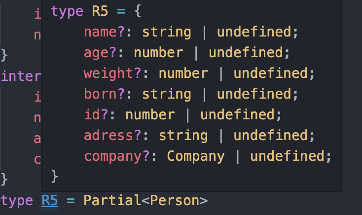
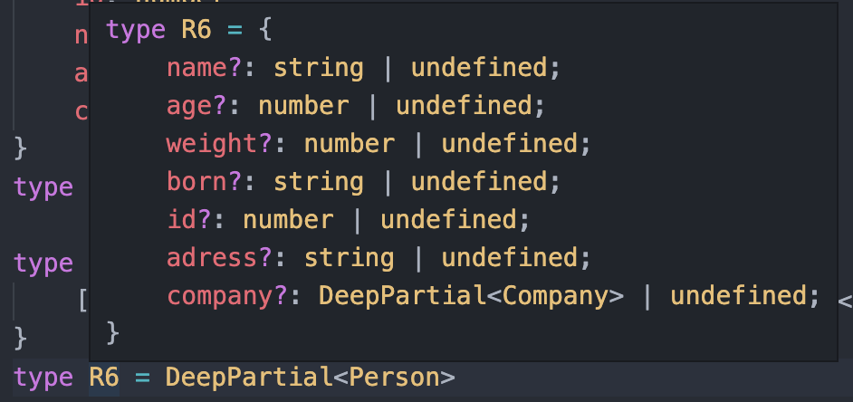
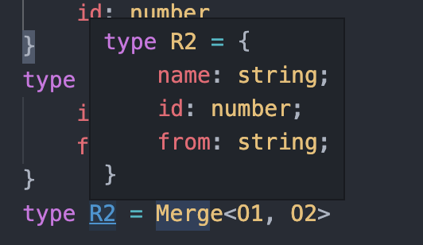

# 常用工具类型

介绍一些类型工具的设计与实现。

## **1 工具类型的设计**

### 1.1 泛型

可以把工具类型类比 javascript 中的工具函数，js 中的工具函数，必须有输入和输出。在 TS  的类型系统中能担当类型入口的只有泛型。

可以说,一切类型工具的基础就是泛型。

### 1.2 类型递归

```
interface Company {
    id: number
    name: string
}
interface Person {
    id: number
    name: string
    adress: string
    company: Company
}
type R5 = Partial<Person>

//原理：对外层的value做个判断,如果恰好是object类型,那么对他也进行属性可选化的操作即可.
type DeepPartial<T> = {
    [U in keyof T]?: T[U] extends object ? DeepPartial<T[U]> : T[U]
}
type R6 = DeepPartial<Person>
```

上述代码中，Partial<T> 只能把最外层属性变为可选的。想处理深层属性，就必须用到类型递归，DeepPartial<T> 就是使用类型递归的例子🌰，使外层和深层属性均变为可选的。

输出：





### 1.3 关键字

+、- 这两个关键字用于映射类型中给属性添加修饰符。

例子🌰：

```
type Required<T> = { [P in keyof T]-?: T[P] };
```

上述代码中，`-?` 代表将可选属性变为必选。

`-readonly`代表将只读属性改为非只读。

## **2 常见工具类型解读**

### 2.1 Omit<T, K>

作用：忽略T中的K属性

```
type Omit<T, K> = Pick<T, Exclude<keyof T, K>>
type Foo = Omit<{name: string, age: number}, 'name'> // -> { age: number }
```


### 2.2 Merge<O1, O2>

作用：将两个对象的属性合并

```
//将交叉类型合并
type Compute<A extends any> =
    A extends Function
    ? A
    : { [K in keyof A]: A[K] }

type Merge<O1 extends object, O2 extends object> = Compute<O1 & Omit<O2, keyof O1>>

type O1 = {
    name: string
    id: number
}
type O2 = {
    id: number
    from: string
}
type R2 = Merge<O1, O2>
```

输出：



### 2.3 Intersection<T, U>

作用：取T和U的共同属性

```
type Intersection<T extends object, U extends object> = Pick<
  T,
  Extract<keyof T, keyof U> & Extract<keyof U, keyof T>
>;

type Props = { name: string; age: number; visible: boolean };
type DefaultProps = { age: number };
// Expect: { age: number; }
type DuplicatedProps = Intersection<Props, DefaultProps>;
```

### 2.4 Overwrite<T, U>

用U的属性覆盖T的相同属性

```
//TODO 有问题
type Overwrite<
  T extends object,
  U extends object,
  I = Diff<T, U> & Intersection<U, T>
> = Pick<I, keyof I>;

type Props = { name: string; age: number; visible: boolean };
type NewProps = { age: string; other: string };
// Expect: { name: string; age: string; visible: boolean; }
type ReplacedProps = Overwrite<Props, NewProps>
```

### 2.5 Mutable

将所有属性的readonly移除

```
type Mutable<T> = {
    -readonly [P in keyof T]: T[P]
}
```

