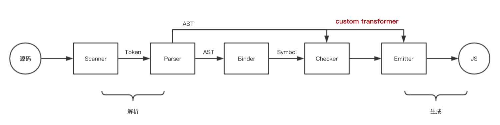

# TypeScript的编译原理

## 1 Typescript 编译器的组成部分：

- Scanner
- Parser
- Binder
- Emitter
- Checker

## 2 编译器的处理流程

粗略分为3步：解析->转化->生成

Typescript允许开发者 通过编写 TypeScript Transformer Plugin 的方式控制最终生成的 js 代码。

上图中，从解析源代码到生成AST之间的步骤是typescript控制的,我们无法干涉,我们能做的是访问AST的节点并修改其携带的信息和节点与节点之间的关系,最终生成新的AST,再根据新AST生成代码,这样我们就达到了控制代码转换的目的。

## 3 例子🌰

//TODO