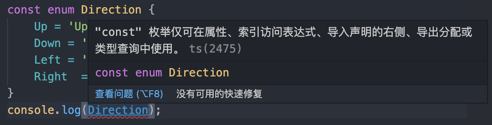

# 枚举

> 枚举类型是很多语言都拥有的类型,它用于声明一组命名的常数,当一个变量有几种可能的取值时,可以将它定义为枚举类型。

## 1 数字枚举

```typescript
enum Direction {
    Up,
    Down,
    Left,
    Right
}
console.dir(Direction);
//输出：
{
    "0": "Up",
    "1": "Down",
    "2": "Left",
    "3": "Right",
    "Up": 0,
    "Down": 1,
    "Left": 2,
    "Right": 3
}
//编译后的代码：
"use strict";
var Direction;
(function (Direction) {
    Direction[Direction["Up"] = 0] = "Up";
    Direction[Direction["Down"] = 1] = "Down";
    Direction[Direction["Left"] = 2] = "Left";
    Direction[Direction["Right"] = 3] = "Right";
})(Direction || (Direction = {}));
console.dir(Direction);
```


## 2 字符串枚举

```typescript
enum Direction {
    Up = 'Up',
    Down = 'Down',
    Left = 'Left',
    Right  = 'Right'
}
console.log(Direction);
//输出：
{
    "0": "Up",
    "1": "Down",
    "2": "Left",
    "3": "Right",
    "Up": "Up",
    "Down": "Down",
    "Left": "Left",
    "Right": "Right"
}
//编译后的代码：
"use strict";
var Direction;
(function (Direction) {
    Direction["Up"] = "Up";
    Direction["Down"] = "Down";
    Direction["Left"] = "Left";
    Direction["Right"] = "Right";
})(Direction || (Direction = {}));
console.log(Direction);
```


## 3 常量枚举

```typescript
const enum Direction {
    Up = 'Up',
    Down = 'Down',
    Left = 'Left',
    Right  = 'Right'
}
console.log(Direction.Down);
//编译后的代码：
"use strict";
console.log("Down");
```

注意⚠️：常量枚举编译时会把Direction去掉，只编译使用的枚举类型的值，这是**性能提升的一个方案**。如果编译后非要保留Direction对象，可以添加编译选项`--preserveConstEnums`。

常量枚举使用的注意点：



## 4 枚举的本质

参考1中数字枚举编译后的代码。

## 5 小结

我们本节深入理解了枚举类型,通过编译后的 JavaScript 了解到**枚举其实本质上是 JavaScript 对象。**

