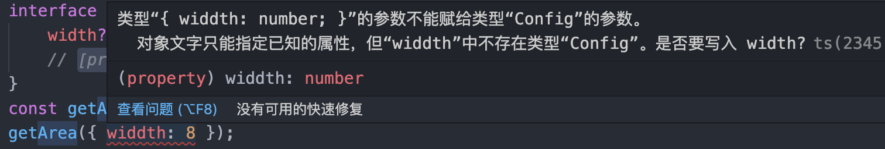

# 接口

>TypeScript 的核心原则之一是对值所具有的结构进行类型检查,它有时被称做“鸭式辨型法”或“结构性子类型化”。
>
>在TypeScript里，接口的作用就是为这些类型命名和为你的代码或第三方代码定义契约

## 1 接口的使用（可选属性、只读属性、函数类型）

```typescript
interface User {
    name: string;
    age?: number;  // 可选属性 number | undefined
    readonly isMale: boolean; // 只读属性
    // say: (words: string) => string; // 函数属性
    say: Say
}
// 函数类型
interface Say {
    (words: string): string;
}
const getUserName = (user: User) => user.name;
```


## 2 属性检查

如果一个对象字面量存在任何“目标类型”不包含的属性时，你会得到一个错误。




比较推荐的解决办法（推荐使用 **类型断言**）：

```typescript
interface Config {
    width?: number;
    [propName: string]: any // 方法2: 使用 添加字符串索引签名
}
const getArea = (config: Config) => config.width;
getArea({ widdth: 8 } as Config); // 方法1: 使用 类型断言  🍇推荐使用
```


## 3 可索引类型

场景：如果 User 包含一个属性，这个属性是 User 拥有的邮箱的集合，但是这个集合有多少成员不确定，应该如何描述？

```typescript
interface Phone {
    [name: string]: string
}
interface User {
    name: string
    age?: number
    readonly isMale: boolean
    say: () => string
    phone: Phone
}
```


## 4 继承接口

⚠️注意：一个接口可以继承多个接口。

```typescript
interface VIPUser extends User, SupperUser {
    broadcast: () => void
}
```

