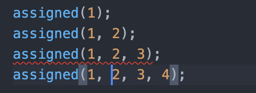

# 函数

## 1 函数的参数

```typescript
// 1.可选参数
const add = (a: number, b?: number) => a + (b ? b : 0)
//2. 默认参数
const add = (a: number, b = 10) => a + b
//3. 剩余参数
const add = (a: number, ...rest: number[]) => rest.reduce(((a, b) => a + b), a)
```


## 2 **重载**

```typescript
interface Direction {
    top: number
    right: number
    bottom: number
    left: number
}
function assigned(all: number): Direction;
function assigned(top: number, right: number): Direction;
function assigned(top: number, right: number, bottom: number, left: number): Direction;
// 函数实现,不可被调用
function assigned (a: number, b?: number, c?: number, d?: any) {
    if (b === undefined && c === undefined && d === undefined) {
      b = c = d = a
    } else if (c === undefined && d === undefined) {
      c = a
      d = b
    }
    return {
      top: a,
      right: b,
      bottom: c,
      left: d
    }
}
assigned(1);
assigned(1, 2);
// assigned(1, 2, 3); // 报错
assigned(1, 2, 3, 4);
```



## 3 小结

涉及多人使用的库相关开发，函数重载可谓是必不可少的利器。

值得一提的是,著名的全局状态管理库 Redux 的[compose](https://github.com/reduxjs/redux/blob/26f216e066a2a679d3cae4fb1a5c4e5d15e9fac6/src/compose.ts#L16)就是运用大量函数重载的典型案例。

