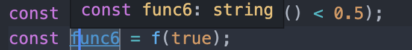
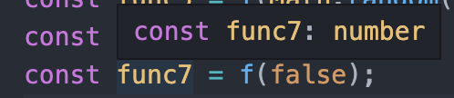
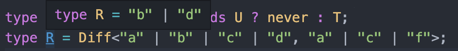
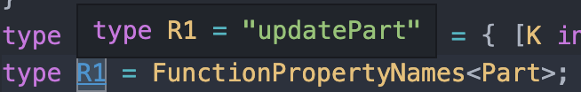

# 高级类型之条件类型

有时候我们并不能在编写代码的时候就把类型确定，那么这个时候需要用到条件类型了。

> TypeScript 在2.8版本之后引入了条件类型(conditional type).

## 1. 语法

```typescript
T extends U ? X : Y
```

条件类型，**只有类型系统中给出充足条件之后，它才能根据条件推断出类型结果**。

## 2 使用🌰

```typescript
declare function f<T extends boolean>(x: T): T extends true ? string : number;
const func5 = f(Math.random() < 0.5);
const func6 = f(true);
const func7 = f(false);
```

func5、func6、func7的类型分别如下：






## 3 **条件类型与联合类型**

条件类型有一个特性，是**分布式有条件类型**，**分布式有条件类型在实例化时会分发成联合类型**。

**分布式有条件类型**的前提：条件类型里待检查的类型必须是 **naked type parameter(裸类型参数).**

### 3.1 概念理解

一个例子**🌰：**

```
// 裸类型参数,没有被任何其他类型包裹即T
type NakedUsage<T> = T  extends boolean ? 'YES' : 'NO';
// 类型参数被包裹的在元组内即[T]
type WrappedUsage<T> = [T] extends [boolean] ? "YES" : "NO";

type Distributed = NakedUsage<number | boolean> // = NakedUsage<number> | NakedUsage<boolean> = "NO" | "YES"
// 等价于
// type Distributed = NakedUsage<number> | NakedUsage<boolean>
```

上述代码中，当我们给类型NakedUsage加入联合类型number | boolean时, 它的结果返回"NO" | "YES",相当于联合类型中的number和boolean分别赋予了NakedUsage<T>然后再返回出一个联合类型。

### 3.2 使用

需求：设计一个类型工具Diff<T, U>,我们要找出T类型中U不包含的部分:

type Diff = T extends U ? never : T; type R = Diff<"a" | "b" | "c" | "d", "a" | "c" | "f">;

输出：

## 4 条件类型与映射类型

需求：编写一个工具类型将interface中函数类型的名称取出来。

```
interface Part {
    id: number;
    name: string;
    subparts: Part[];
    updatePart(newName: string): void;
}
type FunctionPropertyNames<T> = { [K in keyof T]: T[K] extends Function ? K : never }[keyof T]
type R1 = FunctionPropertyNames<Part>;
```

输出：



重点分析：

1. [K in keyof T] 相当于遍历整个 interface
2. { [K in keyof T]: T[K] extends Function ? K : never } 操作后，得到的新interface为：

```
type R = {
    id: never;
    name: never;
    subparts: never;
    updatePart: "updatePart";
}
```

3. 最后使用 [keyof T] 作为key依次取出新interface的value，由于id，name，subparts的值为never ，不会返回任何类型，所以只返回了'updatePart'。